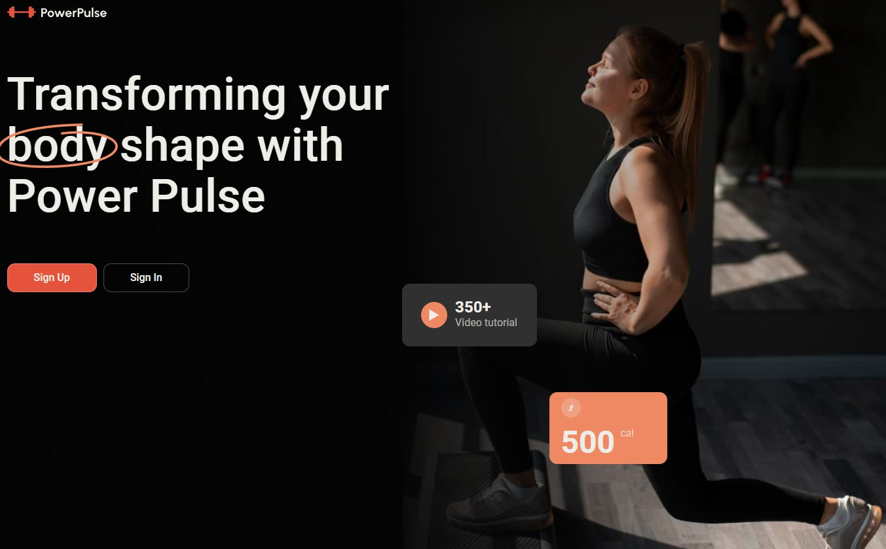
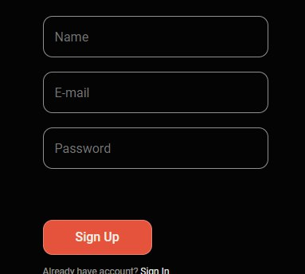
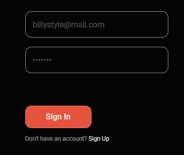
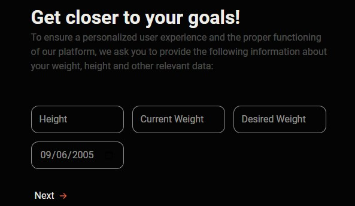
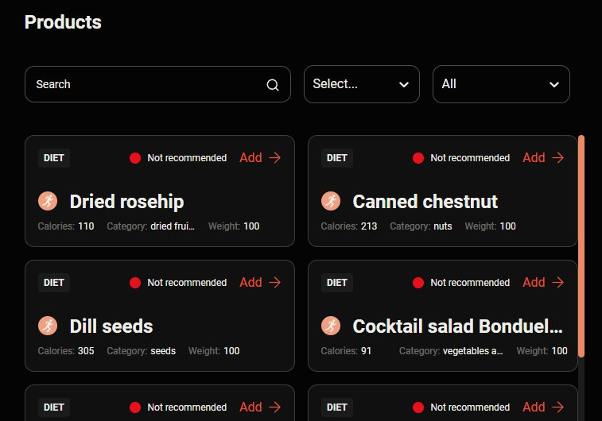
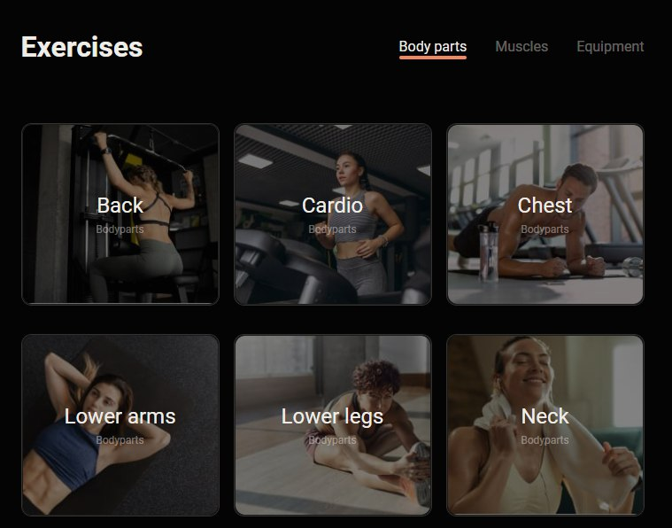
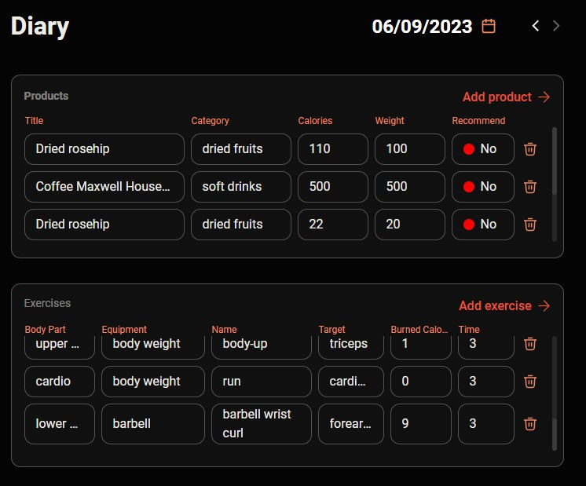
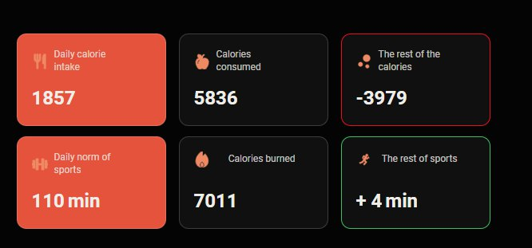

# [Power-Pulse-GoIt](https://sat98ram.github.io/power-pulse-goit/)

With the help of this application, you will always be able to keep yourself in good physical shape and enjoy life with us. We are glad that you have used this resource and we think that you will enjoy it

### [Power-Pulse-GoIt](https://sat98ram.github.io/power-pulse-goit/)

The project is aimed at people who seek self-development and always be in good shape

- The project is designed as a diary
- No one will be able to use the recordings without your knowledge
- You will be able to use the diary on any device and in a place, wherever you are

## Technologies Used

- Frontend

  - [React](https://uk.legacy.reactjs.org/)
  - [JavaSсript](https://uk.javascript.info/)
  - [CSS](https://developer.mozilla.org/ru/docs/Learn/Getting_started_with_the_web/CSS_basics)
  - [Axios](https://axios-http.com/)
  - [Formic](https://formik.org/)
  - [Redux-toolkit](https://redux-toolkit.js.org/)
  - [React responsive](https://www.npmjs.com/package/react-responsive)
  - [Yup](https://www.npmjs.com/package/yup)
  - [Redux-persist](https://www.npmjs.com/package/redux-persist)
  - [PropTypes](https://www.npmjs.com/package/prop-types)

## Use of the site

- The site is adapted for any devices
- You will be greeted by a convenient login and registration page

   

- After registration, you will be asked to enter your individual indicators in three steps, according to which your data will be calculated for entry into the diary

  

- After successfully entering the data, you will be able to fully appreciate our application and enjoy using it
- On the product page, you will choose your favorite dishes and see the number of calories in them. you can always sort them according to your wishes

  

- On the exercise page, you can choose your favorite exercises for different muscle groups and you can start a timer when you perform the selected exercise

  

- On the page diary you will be able to track the data you entered by day in convenient tables

  

- Your cycles of training and consumed food will always be translated into a table of numbers by a convenient calculator that will immediately display the changes after they are entered

  

### Our team is pleased with your choice of application and wishes you good health and creative inspiration

## Documentation

1. Clone the repository: `https://github.com/Sat98Ram/power-pulse-goit`
2. Navigate to the project directory: ` cd power-pulse-goit`
3. Install all dependencies: `npm i`
4. Start the project: ` npm run dev`
5. Use the project on: ` http://localhost:5173/power-pulse-goit`

## Contacts

#### Web site

#### YouTube

